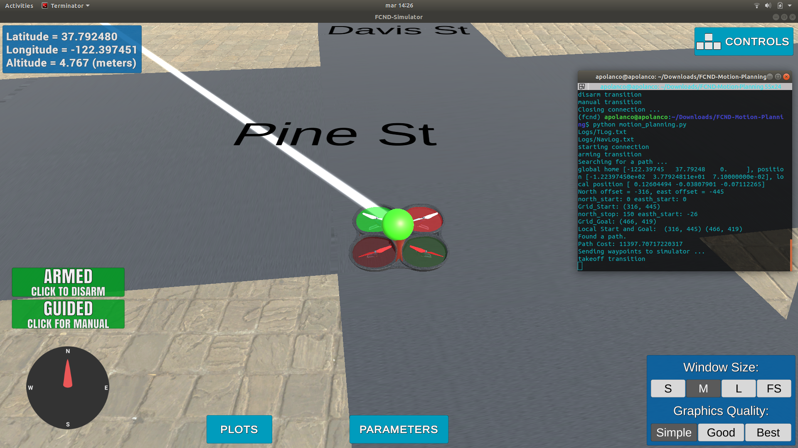

## Project: 3D Motion Planning

---

# Required Steps for a Passing Submission:
1. Load the 2.5D map in the colliders.csv file describing the environment.
2. Discretize the environment into a grid or graph representation.
3. Define the start and goal locations.
4. Perform a search using A* or other search algorithm.
5. Use a collinearity test or ray tracing method (like Bresenham) to remove unnecessary waypoints.
6. Return waypoints in local ECEF coordinates (format for `self.all_waypoints` is [N, E, altitude, heading], where the drone’s start location corresponds to [0, 0, 0, 0].
7. Write it up.
8. Congratulations!  Your Done!

## [Rubric](https://review.udacity.com/#!/rubrics/1534/view) Points
### Here I will consider the rubric points individually and describe how I addressed each point in my implementation.  

---
### Writeup / README

#### 1. Provide a Writeup / README that includes all the rubric points and how you addressed each one.  You can submit your writeup as markdown or pdf.  

You're reading it! Below I describe how I addressed each rubric point and where in my code each point is handled.

### Explain the Starter Code

#### 1. Explain the functionality of what's provided in `motion_planning.py` and `planning_utils.py`
In the original code is assumed that the home position of the drone is it's first location, but actually the drone needs to be able to start to plan from any position. The first step is to modify the code in order to read the global home location from the first line of colliders.csv file and take that position as a global home (self.set_home_position())

The home position is read at motion_planning.py line 147. 

Then we are going to set the grid start position from local position

After that lets set the grid goal position taking in count the geodetic coords

Next lets add some diagonal movements into the action class, also check for obstacles for the drone

Using Collinearty Check Method lets remove unnecessary waypoints in the path, breifly, three points p_1, p_2p,p_3 to be collinear, the determinant of the matrix that includes the coordinates of these three points as rows must be equal to zero in three dimension ( necessary but not sufficient) Detail. However in two dimension,z coordinate simply set to 1 and the determinant being equal to zero indicates that the area of the triangle is zero. It is a sufficient condition for collinearity.

### Execute the flight
#### 1. Does it work?
It works!

